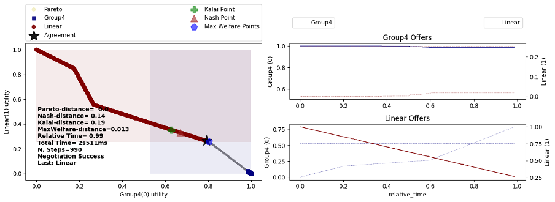
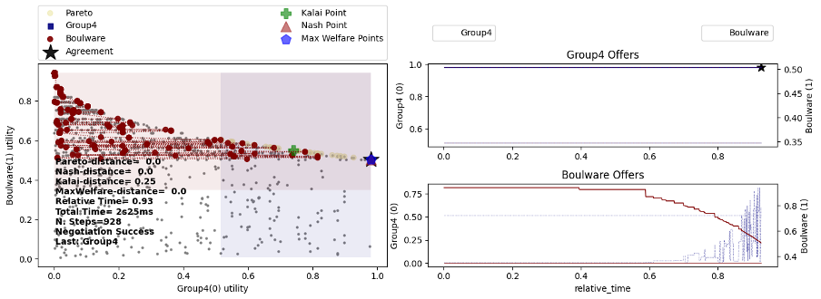
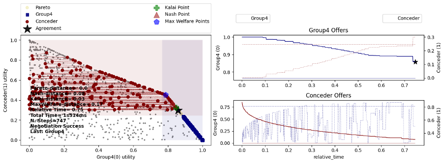
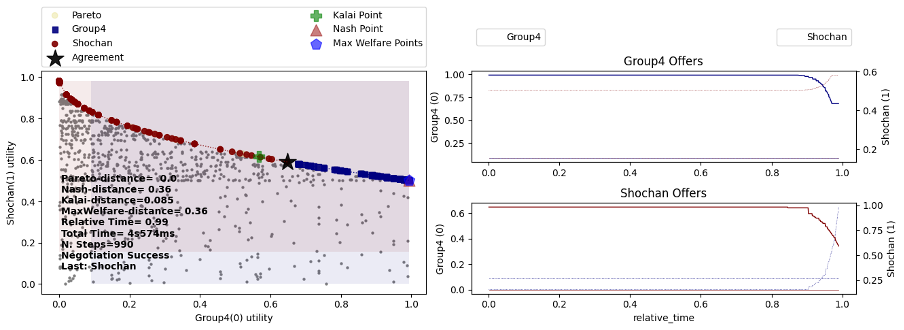
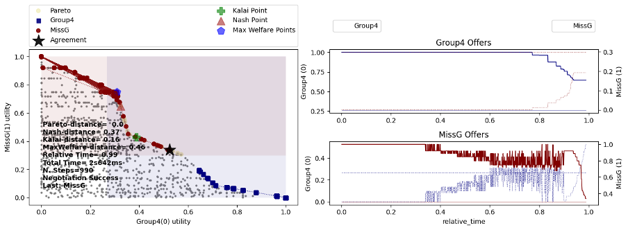
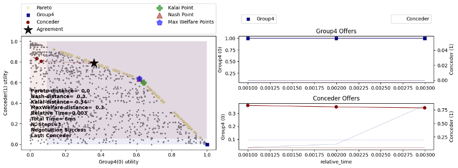
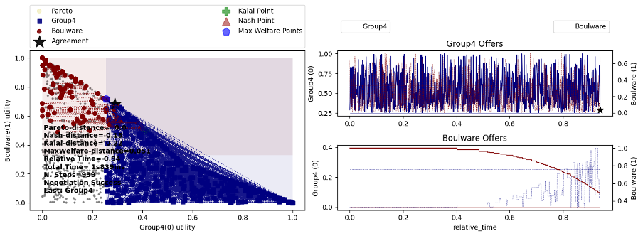
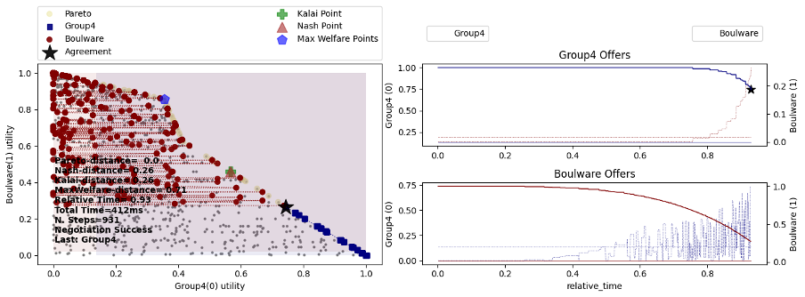

# Autonomous Negotiation Agent for ANL2025
## Introduction
We developed an intelligent negotiation agent based on the Automated Negotiation League (ANL) platform. The agent is designed to maximize utility while dynamically adapting to different opponent strategies. It employs a **time-dependent aspiration-based bidding strategy, an adaptive acceptance mechanism, and opponent modeling** to evaluate negotiation patterns and estimate reservation values. 
<br><br>
The agent adjusts its concession patterns by tracking and classifying opponents' strategies accordingly. Leveraging **Pareto-optimal outcomes**, it ensures efficient and competitive offers. Extensive testing demonstrated its ability to balance strategic rigidity with flexibility, achieving strong performance across diverse negotiation scenarios.

## Running the Agent
To run your the, the only required steps are the following:

1. [recommended] create a virtual environment, or use your favorite IDE to do
   that for you.
  - Install venv

    > python3 -m venv .venv

  - Activate the virtual environment:

    - On linux

      > source .venv/bin/activate

    - On windows (power shell)

      > call .venv\bin\activate.bat

2. [required] **Install anl**
    > pip install anl

3. [recommended] You can run a simple tournament against basic
   strategies by running ``maxpareto.py`` from the command line (in this folder):

    > python -m agnet.maxpareto

## High-level Overall Agent Description
We implemented a **Tit-for-Tat** negotiation strategy, enabling our agent to adapt based on the opponent’s perceived behavior while maximizing utility through structured decision-making. This is achieved using a time-dependent aspiration function and an opponent modeling mechanism to refine bidding and acceptance decisions.
<br><br>
A core component of this strategy is the aspiration function, which dictates how offers evolve over time:
```math
asp(t) = (mx-rv)(1-t^e)+rv
```
Unlike static threshold approaches, our aspiration function dynamically adjusts its concession based on the opponent’s strategy. Against cooperative opponents, it maintains a high threshold for longer, conceding gradually. Against aggressive or defecting opponents, it delays concessions, ensuring competitive offers before strategically lowering expectations as the deadline approaches. This adaptation allows the agent to optimize offers rather than follow a fixed negotiation path.
<br><br>
Our acceptance strategy is rarely accepting offers in the first 90% of the negotiation. This allows the agent to gather information and maintain a firm stance. As the deadline nears, the acceptance threshold gradually decreases, ensuring flexible decision-making while securing an agreement before time runs out.
<br><br>
To ensure strategic soundness, the agent prioritizes Pareto-optimal outcomes, never bidding or accepting offers below the Nash or Kalai solution (whichever is lower). If an opponent’s offer is not Pareto-efficient, the agent counters with the closest Pareto-optimal offer. This multi-criteria approach ensures efficiency and strategic advantage.
<br><br>
Our agent filters the outcome space to retain only Pareto-frontier solutions, and using the minimal Nash-Kalai offer as the minimum acceptance threshold. It initializes its aspiration function with a concession exponent of 17.5, which is dynamically adjusted based on the opponent’s strategy, but always stays above 1. The aspiration threshold is recalculated in each round within the `__call__` function.

---

### Acceptance Strategy
```python
def acceptance_strategy(self, state: SAOState) -> bool:
```
After testing and experiencing the platform, we observed a clear pattern - opponents tend to concede over time, leading to better offers as negotiations progress. Accepting early offers often results in **suboptimal outcomes**, as better agreements may arise later.

Our acceptance strategy follows three main phases:
<br><br>
**Early Segment (t < 0.9):** 

Reject nearly all offers, except those providing at least 1.5 times advantage to our favor, against the opponent’s predicted advantage.

**Critical Segment (t > 0.9):**

- Reject offers below min(Nash, Kalai).
- Accept offers above the aspiration threshold.
- If a Pareto-optimal set exists, find the closest offer to the opponent’s last bid:
  - Accept if its utility for us is lower than the opponent’s latest offer.
  - Otherwise, if it exceeds our threshold, save it as our next bid.
- Reject all other offers. 

**Last Resort Segment (Final Steps):**

- In the last 10 steps, consider outcomes below min(Nash, Kalai) if they exceed the threshold.
- In the final two steps, prioritize securing any agreement above our reserved value, accepting any such offer to avoid unnecessary rejection.

Our agent maximizes utility by identifying a candidate offer that maintains the opponent’s utility while improving our own. This ensures better agreements than those based on a static threshold, without harming the opponent’s position, ultimately securing a stronger deal.

---

### Bidding Strategy
```python
def bidding_strategy(self, state: SAOState) -> Outcome | None:
```
Our bidding strategy, like our acceptance strategy, is divided into three phases. While acceptance focuses on rejecting early offers to secure better ones later, bidding is designed to find the most advantageous offer while ensuring an agreement is reached.

**Immediate Return: Using the Next Offer**

If a next_offer was identified in the acceptance strategy, it is immediately returned. This Pareto-optimal offer maximizes our utility while keeping the opponent’s utility similar to their last offer, increasing acceptance likelihood. This is the only offer returned immediately, all other conditions are evaluated before finalizing the bid.

**Main Bidding Phase: Selecting the Best Offer** 

If no next_offer exists, the agent evaluates offers sequentially:
- Prioritize Pareto-optimal offers above the current aspiration threshold, selecting the closest one to maintain controlled concession.
- If no Pareto-optimal option is available, bid our highest utility offer.
- Identify the offer closest to the opponent’s predicted reservation value. If it provides us a greater advantage than the opponent and has a higher utility than any previous offer, we bid it.

**Failsafe: Securing Agreement & Avoiding Bad Bids**

To prevent losing agreements or making poor bids, we apply safeguards:
- If the selected offer is below min_offer (min(Nash, Kalai)) and more than 10 steps remain, we replace it with min_offer.
- In the last two steps, bid the closest offer to our reserved value from the opponent’s previous offers, increasing agreement likelihood.
- If no valid offer is found, default to the highest utility offer (ufun.best()).

Once all conditions are evaluated, the selected offer is returned as our bid. This ensures our agent pursues optimal Pareto agreements, explores potential better outcomes, and avoids losing deals in the final moments.

---

### Update Partner Reserved Value
``` python 
def update_partner_reserved_value(self, state: SAOState) -> None:
```
Our agent predicts the opponent’s **reserved value** by tracking the utility scores of their past offers. These values are stored and used for **curve fitting** to estimate both their reserved value and **concession exponent**. To align with our **Tit-for-Tat strategy**, we adjust our concession exponent based on the opponent’s behavior:
- If the opponent concedes very little, we set our exponent to 7× their average concession exponent.
- Otherwise, we set our exponent 1 point higher than theirs, maintaining a balanced but strategic concession rate.
- If insufficient offers exist to compute a mean, we estimate their reserved value as half the lowest utility score among their offers.
- 
Finally, we update the opponent’s rational outcomes based on the revised reserved value:
- If their reserved value increases, we remove irrational outcomes.
- If it decreases, we regenerate the rational outcome set.
- We then create a shared list of rational outcomes for both parties to refine future bids.

## Testing Agent's Perfomance
Throughout the whole project, we conducted extensive tests against different opponents, to identify our weak spots and improve them. We created an extra file, named run.py, that tested our agent in a loop against different opponents and saved the resulting plot. That helped us to refine our strategy and agent’s functions. Most of our strategy and key decisions resulted from analyzing the plots, such as deciding not to accept early offers, not accepting offers below Nash point and more.

We performed three main types of evaluations:
1. ANL Built-in Negotiators – testing against Conceder, Boulware, and Linear.
2. Diverse Strategies Tests - testing agents from the ANL 2024 Contest.
3. Evaluation Tests – running the agent with and without key features to evaluate their impact on  performance.  

At first we tested our agent we evaluated its performance against ANL built-in negotiators. This helped us to find a starting point for the negotiation. After that we started to compete against general agents with diverse Strategies from the ANL 2024 contest. We examined each competition separately and evaluated our agent results. Every time we lose we learn from this case and adapt our strategy so that we will not lose in the same situation next time.

---
### ANL Built-in Negotiators

**Linear:** running our agent against the linear built-in agent resulted in the maximal Pareto outcome possible, just above the opponent's reserved value. This is achieved by holding our high demands and barely conceding, waiting for the linear to gradually decrease its offer to its reserved value.


**Boulware:** negotiating against Boulware opponents was challenging, as they maintained high-value offers until late concessions. Our agent countered by adjusting their offers to the Pareto frontier, securing a favorable deal while avoiding negotiation failure.


**Conceder:** negotiating against the Conceder followed a pattern where the Conceder agent continuously lowered its offers throughout the process. Our agent also adapts by conceding more gradually compared to other opponents, as shown in the top-right graph. This approach ensures that we steadily move closer to a Pareto-optimal outcome in our favor. Toward the end, once the Conceder has already significantly lowered its offers, we propose an offer it cannot reject—one that aligns with the utility it previously accepted but now positioned on the Pareto frontier. This guarantees an agreement just above its reservation value, maximizing our advantage.


---
### Diverse Strategies Tests
**Shochan - ANL2024 Winner:** naturally, one of the toughest opponents we tested our agent against was Shochan, the winner of the ANL2024 competition. We learned a lot from analyzing its code and running tests against it.


**HardChaos and MissG - ANL2024:** another two agents we tested ours against were Hard Chaos and MissG. We tested various approaches that helped us to effectively improve our use of predicting the opponent's reserved value. When running a negotiation against them now, we are securing an agreement that just a bit above the opponent's reserved value, ensuring we are getting the best outcome was possible.



---
### Evaluation Tests
We conducted additional tests, one for each modified function, where we replaced the modified ones with the original skeleton functions, to assess the contribution of each modification.

**Default Acceptance:** without the modified acceptance strategy the agent accepts too quickly, without allowing the opponent to concede, thus missing a better deal.


**Default Bidding:** The default bidding strategy selects a random outcome from the set of rational outcomes at each turn. This approach is risky and ineffective, as it proposes arbitrary outcomes without any consideration, leading to unfavorable agreements.


**Default Partner Reserved Value:** our agent performs well even without the modified partner reserved value function. It leverages the modified acceptance strategy to decline most early offers, allowing the opponent time to concede, while the bidding strategy gradually concedes towards an optimal outcome.


## Key Strengths and Weaknesses
Our agent dynamically adjusts its strategy based on the opponent’s behavior, effectively implementing the Tit-for-Tat approach while prioritizing favorable outcomes and avoiding premature concessions. This adaptability allows it to perform well across different opponent types and negotiation domains. However, its biggest weakness is the risk of a timeout if an agreement is not secured in time, potentially resulting in no deal at all. Additionally, while the agent prioritizes Pareto-optimal outcomes, the closest Pareto-optimal outcome to the opponent’s last offer may sometimes be irrational for them, leading to a failed negotiation.

## Future Perspective
Future improvements to our agent include integrating reinforcement learning for adaptive strategy refinement and advanced opponent modeling using deep learning to improve behavior prediction. 
Enhancing multi-issue negotiation capabilities by modeling interdependent preferences would allow for more sophisticated trade-offs. Additionally, refining the balance between Pareto efficiency, Nash equilibrium, and Kalai solutions could optimize the agent’s strategic decision-making in different negotiation contexts.

## Conclusion
Our agent successfully combines adaptive bidding, selective acceptance, and opponent modeling to navigate complex negotiations. By leveraging time-dependent aspiration functions and game-theoretic principles, it balances firmness and flexibility to maximize utility. The agent performs well against Conceder opponents and adapts to Boulware strategies, ensuring every negotiation ends in an agreement. Future enhancements will focus on machine learning integration, multi-issue trade-offs, and more precise opponent adaptation to further improve its performance.
